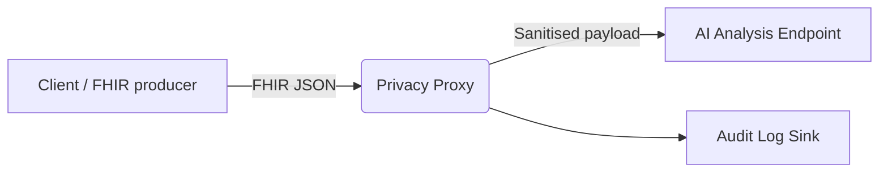
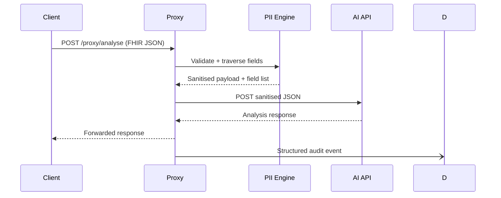

# Healthcare (FHIR) API Privacy & De-Identification Proxy

Engineered a FHIR-compliant privacy proxy that sanitises medical data in real time before AI processing, aligning with Australian Digital Health privacy expectations and post-Medibank breach security priorities.

## Overview

This project delivers a FastAPI-based "middleman" that accepts HL7 FHIR JSON payloads, removes personally identifiable information (PII) based on configurable rules, and forwards the sanitised content to an AI analysis backend. The proxy enforces privacy-preserving defaults that are inspired by Australian Digital Health Agency guardrails and modern breach learnings.

### Key capabilities

- **FHIR-aware validation** – rejects requests without a `resourceType` or missing essential FHIR fields.
- **Configurable PII engine** – redaction, hashing, and masking rules driven by `pii_rules.json` (JSON or YAML) with mask rules taking precedence when both mask and hash rules match the same field.
- **Regex augmentation** – catches Medicare numbers, Australian phone numbers, ISO DOBs, and email addresses even outside explicit fields.
- **Audit logging** – structured JSON logs capture which fields changed without storing raw PII.
- **AI backend proxying** – forwards sanitised payloads to any HTTP endpoint with optional auth headers and correlation IDs.

## Getting started

### 1. Install dependencies & run the API

```bash
python -m venv .venv
source .venv/bin/activate
pip install -r requirements-dev.txt  # runtime + dev tooling
uvicorn main:app --reload --host 0.0.0.0 --port 8000
```

Install the git hooks to guarantee formatting/linting before each commit:

```bash
pre-commit install
make pre-commit  # run the full suite on demand
```

Environment variables:

| Variable | Description | Default |
| --- | --- | --- |
| `AI_ENDPOINT_URL` | Target AI analysis endpoint. | `http://localhost:9000/analyse` |
| `AI_ENDPOINT_TIMEOUT` | Timeout (seconds) for upstream calls. | `20` |
| `AI_AUTH_HEADER` | Optional `Authorization` header sent upstream. | `None` |
| `PII_RULE_PATH` | Path to PII rule file (JSON/YAML). | `pii_rules.json` |
| `AUDIT_LOG_PATH` | File to persist structured audit logs. | `logs/audit.log` |

Duplicate the `.env.example` file if you prefer to manage settings via dotenv workflows.

### 2. Configure privacy rules

`pii_rules.json` defines which field paths are redacted, hashed, or masked. Field paths follow `Resource.field.subfield` notation with `*` acting as a wildcard token (e.g. `*.identifier.value`). Mask rules are evaluated before hash rules so that you can expose partially masked values for specific resources while still hashing the rest via a wildcard rule.

```json
{
  "hash_salt": "demo-salt",
  "redact_fields": ["Patient.name", "Patient.address", "Patient.telecom"],
  "hash_fields": ["Patient.identifier.value"],
  "mask_fields": [
    {"path": "Patient.identifier.value", "visible": 3, "mask_char": "#"}
  ]
}
```

### 3. Example flow

1. `POST /proxy/analyse` with a Patient resource.
2. Proxy validates FHIR basics.
3. `pii_engine` traverses the JSON, redacting or hashing configured paths and regex-detected values.
4. Sanitised payload + correlation headers forwarded to AI endpoint.
5. Structured audit entry recorded: request ID, client IP, resource type, and field paths modified.

#### Sample Patient before/after

- `examples/patient_before.json`
- `examples/patient_after.json`

The identifiers are hashed via the wildcard `*.identifier.value` rule, while the `managingOrganization.reference` attribute is partially masked through `mask_fields`. Contact details, addresses, DOB, and telecom entries are fully redacted.

### 4. Curl example

```bash
curl -X POST http://localhost:8000/proxy/analyse \
  -H 'Content-Type: application/fhir+json' \
  -H 'X-Request-ID: demo-123' \
  -d @examples/patient_before.json
```

### 5. Mocking the AI backend

Run the bundled mock server:

```bash
make mock-ai
```

The mock exposes `POST /analyse` on port `9000` and returns a short acknowledgement that mirrors how an AI endpoint would reply. The proxy forwards sanitised payloads and returns the backend response transparently.

### 6. Audit logs

Logs are emitted both to stdout and (optionally) to `logs/audit.log` as JSON lines:

```json
{"timestamp": "2025-03-15T04:12:51+00:00", "request_id": "demo-123", "resource_type": "Patient", "client_host": "127.0.0.1", "status": "success", "modified_fields": ["Patient.name:redacted", "Patient.identifier[0].value:hashed"]}
```

## Testing

A lightweight pytest suite validates FHIR enforcement and PII transformations:

```bash
make lint   # ruff
make format # black
make test   # pytest with asyncio support
```

The suite now covers:

- PII engine behaviours (redaction, masking precedence, hashing, regex detection).
- FHIR validation errors.
- End-to-end FastAPI proxy forwarding using an in-memory `httpx.MockTransport` to ensure only sanitised payloads leave the service.

> **Note:** The FastAPI/httpx integration tests are skipped automatically if those optional developer dependencies are not installed in the current environment.

### Developer workflow

- `.editorconfig` standardises indentation/newline rules across IDEs.
- `.pre-commit-config.yaml` keeps formatting, linting, and type-checking consistent. Run `make pre-commit` locally or let CI enforce the hooks.
- `CODE_OF_CONDUCT.md`, `CONTRIBUTING.md`, and `SECURITY.md` describe the human processes around the codebase.

## Repository layout

```
├── audit_logger.py      # Structured audit log emission utilities
├── config.py            # Environment + rule loading logic
├── docs/                # Deployment, API, and architecture runbooks
├── examples/            # Before/after FHIR payloads
├── pii_engine.py        # Recursive sanitisation engine
├── scripts/mock_ai.py   # Mock AI backend for demos/tests
├── tests/               # Pytest suites
└── docker-compose.yml   # Local proxy + mock AI stack
```

## Docker & Compose

Container images can be built via `make docker-build` (or `docker build -t fhir-privacy-proxy .`).
For a complete local environment that includes the mock AI backend, run:

```bash
docker compose up --build
```

The proxy listens on `http://localhost:8000` and forwards sanitised traffic to `mock-ai:9000`.

## Architecture snapshot



PII sanitisation pipeline:



## Privacy notes

- The proxy never stores raw patient attributes; audit entries only capture field paths.
- Hashing uses SHA-256 with a configurable salt for deterministic linkage without exposure.
- Regex detection catches stray identifiers to avoid leakage even when rule paths miss an attribute.
- Deploy behind HTTPS (API Gateway, Nginx, etc.) and rotate API credentials per Australian Digital Health security best practices.

## Resume-ready highlight

> **Engineered a FHIR-compliant privacy proxy that sanitises medical data in real time before AI processing, aligning with Australian Digital Health privacy expectations and post-Medibank breach security priorities.**

## Additional references

- [`docs/DEPLOYMENT.md`](docs/DEPLOYMENT.md) – operations, monitoring, and DR guidance.
- [`docs/API.md`](docs/API.md) – REST contract for `/proxy/analyse` and `/health`.
- [`docs/ARCHITECTURE.md`](docs/ARCHITECTURE.md) – component map and non-functional decisions.
- [`CONTRIBUTING.md`](CONTRIBUTING.md) – workflow expectations for maintainers and contributors.
- [`SECURITY.md`](SECURITY.md) – responsible disclosure process.
- [`CODE_OF_CONDUCT.md`](CODE_OF_CONDUCT.md) – participation guidelines for community members.
